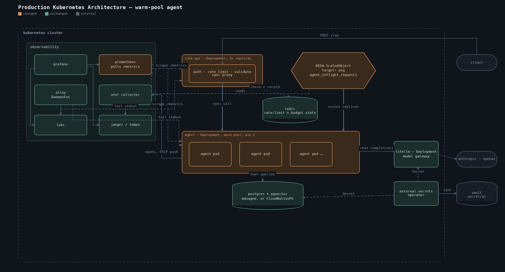

# Design Decisions

A local, docker-compose-based platform for running an LLM agent end-to-end against
NYSE fundamentals/prices and 1.24M ABC News headlines. This document explains what's
in the stack, what's deliberately left out, and how each piece would change moving
toward a real production deployment.

## What's included, and why

| Component | Choice | Why |
|---|---|---|
| Data store | Postgres 16 + pgvector | One database for structured (fundamentals/prices) and unstructured (headlines + embeddings) data. Avoids running a separate vector DB for a corpus this size; `pgvector` is production-viable up to tens of millions of vectors. |
| Model gateway | LiteLLM proxy | Single point where provider/model choice lives. The agent and ingest containers never hold `ANTHROPIC_API_KEY` / `OPENAI_API_KEY` directly — only a local virtual key to the gateway. Swapping Claude ↔ GPT, adding a fallback model, or adding per-model rate limits is a config change in `litellm/config.yaml`, not a code change. |
| Embeddings | OpenAI `text-embedding-3-small`, via the same gateway | Keeps embeddings behind the same key-isolation boundary and swappable the same way as chat models. |
| Agent runtime | FastAPI service with a fixed tool-calling loop | The LLM never sees or writes SQL. It can only call four typed, parameter-validated functions (`get_fundamentals`, `get_price_history`, `search_news_semantic`, `search_news_fulltext`). This is the main safety boundary: prompt injection from a tool result can at worst cause more (read-only) tool calls, not arbitrary data access or mutation. |
| Agent is a persistent service, not a per-call process | `agent` starts once with `docker compose up` and stays running; the deliverable "agent script" (`scripts/run_task.sh`) is a thin `curl` wrapper that calls its already-running `/run` endpoint | The alternative — `docker compose run --rm agent ...` per task — creates a throwaway container and re-checks the whole `depends_on` graph on every single call, purely to make one HTTP request. That's real, avoidable latency (~1-2s) and it obscures the actual architecture (one long-running service handling many requests, which is the production-shaped pattern). `agent/run_task.py` is kept as a containerized fallback for hosts without `curl`/`jq`, or where exposing port 8000 to the host isn't desired — functionally identical, just pays that per-call container cost. |
| DB access control | Separate Postgres roles: ingest (owner/write) vs. `agent_ro` (SELECT-only) | Even a bug in tool code, or a model that somehow got SQL into a query string, cannot write to or drop the data. |
| Observability | OpenTelemetry traces → Jaeger; Prometheus metrics scraped from the agent; Grafana with both wired as datasources | An agent run is a tree of LLM calls and tool calls with unpredictable branching (the model decides how many tool calls to make). A single "it took 4.2s" number is not enough to debug or tune it — you need the trace. Metrics (call counts, latencies, error rates by tool/model) are what you'd actually alert on in production; traces are for debugging a specific bad run. Jaeger UI link is returned directly in the task response (`trace_id`) so a single task run is immediately inspectable. |
| Log aggregation | Grafana Loki (storage) + Grafana Alloy (ships every container's stdout, discovered via the Docker API — no per-service config) | Third pillar alongside traces/metrics — `docker compose logs <service>` only shows one service at a time and loses history when a container is removed. Loki over ELK/EFK for the same reason Prometheus beat a heavier metrics stack: it's the lightweight, Grafana-native choice, and label-indexed rather than full-text so it doesn't care that `postgres`/`litellm`/`jaeger`/etc. all log in different formats. Alloy over Promtail because it's Grafana's current recommended agent (Promtail is in maintenance mode); over the Docker-native Loki logging driver because that requires installing a plugin on the Docker daemon *outside* compose, breaking the "one command, no host prerequisites" property everything else here has. |
| Log/trace correlation (both directions) | Every agent JSON log line carries a top-level `trace_id` field (from the active OTel span context, or explicitly passed via `extra=` where ambient context isn't reliable — see `agent/observability.py`). Wired both ways in Grafana: the **Loki datasource** has a `derivedFields` entry turning any `"trace_id":"..."` in a log line into a click-through link into Jaeger; the **Jaeger datasource** has a `tracesToLogsV2` entry doing the reverse — click any span in a trace view, jump straight to its correlated Loki logs (`{service="agent"} \| json \| trace_id="$${__trace.traceId}"`). | Debugging "why did this task behave oddly" starts from *either* a log line *or* a trace depending on how you noticed the problem — a metric spike leads you to a trace first, a grep through logs leads you to one specific line first. One-directional correlation only helps half the time; wiring both means you're never stuck manually copy-pasting a trace ID between two UIs regardless of which one you started from. |
| Token/cost usage metrics | `agent_llm_tokens_total{model,type}`, `agent_llm_cost_usd_total{model}`, `agent_task_tokens_total` + `agent_task_cost_usd` histograms — all also returned in the `/run` response and set as span attributes | Tokens, not call count, are what map to actual spend — a task with 2 calls and 50k tokens costs more than one with 6 calls and 3k tokens. The `model` label is the **resolved** provider/model (e.g. `anthropic/claude-sonnet-4-5-20250929`, read from litellm's `x-litellm-model-name` response header), not our `AGENT_MODEL` routing alias (e.g. `claude-agent`) — the alias is a config knob, the resolved model is what actually generated the tokens and what you'd bill against. Cost is litellm's own `x-litellm-response-cost` (its live per-model pricing), not tokens × a price table we'd have to keep in sync ourselves. The per-task histograms (as opposed to just the running counters) exist specifically so an alert can ask "did *any single* task exceed $X" — a counter alone can only answer "what's the total so far." |
| Uniform service-down detection | `blackbox_exporter` TCP/HTTP-probing every service, rather than relying only on each service's own `/metrics` endpoint | Only `agent` exposes application-level Prometheus metrics we actually scrape (`prometheus.yml`'s `agent` job) — `litellm`, `postgres`, `jaeger`, `grafana`, `otel-collector`, `loki`, `alloy` don't have a native metrics scrape configured (`litellm` does have its own `/metrics` endpoint capability, we just probe its health instead rather than wiring up a second scrape job for it). Probing every service uniformly from the outside (TCP connect or HTTP GET, depending on what the service actually speaks) gives one consistent "is it up" signal across all 9 probed targets instead of partial coverage that quietly misses most of them. |
| Alerting | 7 Grafana alert rules provisioned from `observability/grafana/alerting/rules.yaml` — semantic-search failures, per-task token/cost thresholds, any service down (one alert instance per service, not one opaque alert), task failure rate, LLM call errors, and LLM call p95 latency | Covers the four explicitly requested cases plus three more that round out the same categories (a systemic failure-rate signal beyond just the one known semantic-search cause; the litellm/provider path specifically, distinct from tool errors; a latency leading-indicator before failures start). Thresholds (10,000 tokens, $0.05/task) are configured values, not hardcoded guesses — picked relative to what normal single-tool-call tasks actually cost in this environment (~2.5-3k tokens, ~$0.01), so they flag "notably more expensive than typical" rather than firing on every multi-step task. |
| Task-context logging for alerts | `agent_loop.py` logs a structured `WARNING` (task text + `trace_id`) at the exact moment a token/cost threshold is crossed, a tool call fails, or an LLM call is slow — each alert's `logs_link` annotation is a pre-built Grafana Explore URL (Loki query already filled in) rather than instructional text to copy-paste | A Prometheus alert only ever sees an aggregate number crossing a threshold — it has no way to say *which* task caused it, because that context doesn't exist at the metrics layer. Rather than ship alerts that can only say "something is wrong" with no path to "what," the fix is at the source: log the specific offending context exactly when the threshold-crossing happens, and make the alert one click away from it. |
| `logs_link` is a hardcoded `localhost:3000` URL, not host-agnostic | Tried and ruled out two alternatives first: a relative URL (`/explore?...`) doesn't get auto-linkified by Grafana's annotation renderer at all — it shows as plain text; and Grafana's alert-rule annotation templates (unlike its *datasource* provisioning, which does support `${VAR}` substitution — see `datasources.yml`) only ever have access to `$labels`/`$values`, confirmed by directly testing a throwaway `${SOME_REAL_ENV_VAR}` annotation, which came back completely unsubstituted. | There is no way, within Grafana's own provisioned-annotation system, to make a link that's both clickable *and* correct regardless of which hostname you're viewing Grafana from — those two properties are in genuine tension here, not something a cleverer YAML trick resolves. The link works as a shortcut when Grafana is accessed at `localhost:3000`; otherwise the fallback (copy the LogQL out of the URL's `expr` param, run it manually — see RUNBOOK's "Viewing logs") is host-agnostic by construction and always works. |
| Ingestion | One-shot `ingest` compose service, not a manual script | `docker compose up` alone must produce a working, populated system — see "single command" in the task. Modeled as what would become a scheduled/triggered ETL job in production, not a special human step. |
| Ingestion source | `DATA_SOURCE=auto\|raw\|export` env var, default `auto` | `auto` restores each table from `data/export/<table>.copy.gz` if that file exists, else falls back to parsing the raw CSV (and, for headlines, calling the embeddings API). A successful raw run always writes the export afterward, so **raw ingestion — CSV parsing and OpenAI embedding calls — only ever happens once per table**; every `docker compose up` after that (even after a full `down -v`) takes the fast restore path automatically, no flag required. `raw`/`export` remain as explicit overrides (force a fresh parse; or fail loudly instead of silently falling back) for when you want to be certain which path ran. |
| Raw data ships in the repo, gzipped | `data/raw/{fundamentals,prices,news_headlines}.csv.gz` (~37MB total, down from ~112MB uncompressed) are tracked in git, transparently decompressed on read (`ingest/ingest.py`'s `open_raw()`) | The exercise's raw Kaggle CSVs aren't something every recipient of this repo will have separately — requiring them to have a Kaggle account and manually source the data first is real friction for "clone and run." Shipping them gzipped keeps the actual raw source data (not just our derived Postgres dump) available and inspectable, at a size git handles comfortably, with no runtime cost beyond a transparent `gzip.open()`. Filenames deliberately match their `data/export/*.copy.gz` counterparts (`news_headlines`, not the original `abcnews-date-text.csv`) so the two are obviously paired, not two different naming conventions. Considered and rejected: loading directly from Kaggle via `kagglehub` at ingest time — that trades this one-time repo-size cost for a live dependency on Kaggle credentials (a third secret beyond the two LLM provider keys) and Kaggle's API being reachable, which is worse for exactly the "hand this to someone to quickly test" use case this is optimized for. |
| Ingestion size knobs | `NEWS_EMBED_LIMIT` (headlines sent to OpenAI, default 20,000) and `NEWS_ROWS_LIMIT` (headline rows loaded into Postgres at all, default unlimited) | Kept as two separate knobs because they trade off different things: `NEWS_ROWS_LIMIT` only affects how much data full-text search covers and how long the CSV parse takes (cheap to raise); `NEWS_EMBED_LIMIT` affects real OpenAI API cost and rate limits (expensive to raise). The exercise dataset has 1.24M headlines and we deliberately do **not** run all of them through OpenAI embeddings by default. If you want the full corpus embedded, that's an explicit, standalone, one-time step run *before* the graded `docker compose up`: `NEWS_EMBED_LIMIT=1244184 DATA_SOURCE=raw EXPORT_OVERWRITE=true docker compose run --rm ingest` — it populates `data/export/news_headlines.copy.gz` with the full embedding set (`EXPORT_OVERWRITE=true` is required here since a — smaller, unembedded — export already ships in the repo and the overwrite guard otherwise protects it, see the row below), and every subsequent `docker compose up` (`DATA_SOURCE=auto`) restores it instantly. |
| Export overwrite guard | `EXPORT_OVERWRITE` env var, default `false` | A raw ingestion run never overwrites an existing `data/export/<table>.copy.gz` unless this is explicitly `true`. Without it, a throwaway `DATA_SOURCE=raw NEWS_ROWS_LIMIT=1000` dev run against an empty DB (say, to sanity-check a schema change quickly) could otherwise silently replace a carefully-produced full-corpus export with a tiny one. The run still loads its data into Postgres normally — only the export write is skipped, with a clear log line explaining why and how to force it. |
| Secrets | `.env` (gitignored) for this exercise; real keys pulled from this environment's Vault (`secret/ai`) rather than hardcoded | `.env.example` documents required vars without real values. In this specific environment the real keys already live in Vault, so `.env` is generated from there rather than typed in — closer to how a real deployment would inject secrets (see below) than committing plaintext. |

## What was left out, and why

- **Full-corpus embedding.** Embedding all 1.24M headlines through the OpenAI API is a real batch job (cost + ~hours of throughput-limited calls), not something that belongs in a "stand up locally in one command" exercise. Instead, `NEWS_EMBED_LIMIT` (default 20,000, recent-weighted) bounds it, and `search_news_fulltext` (Postgres `tsvector`/GIN) covers the full 1.24M rows as a keyword-search fallback so the agent's news tool is never silently empty outside the embedded window. This is the single biggest scope cut in the system and the first thing to fix for production (see below).
  - This graceful degradation is not hypothetical: the `OPENAI_API_KEY` from this environment's Vault has no billing/quota (`insufficient_quota` from OpenAI), so every ingest run logs a clear warning and skips embedding entirely, `search_news_semantic` fails fast (a DB existence check, not a wasted API call) with an actionable error telling the model to use `search_news_fulltext` instead, and end-to-end task runs complete correctly using full-text search alone. That's the safety-net design working as intended under a real failure condition, not a bug being papered over.
- **Auth between internal services.** litellm, agent, Postgres, Prometheus, Grafana all trust the docker network. No mTLS, no per-service tokens beyond the one shared LiteLLM master key. Fine inside a single trusted compose network; not fine across a real network boundary.
- **Async task queue / worker pool.** The agent handles a task synchronously in the HTTP request (`/run` blocks until the LLM+tool loop finishes). There's no queue, no retries-as-a-first-class-concept, no horizontal worker scaling. Fine for a demo where one task runs at a time; wrong shape for concurrent production load (see Scale below).
- **PgBouncer / connection pooling beyond the app-level pool.** The agent uses a small `psycopg_pool` (max 10 conns); Postgres itself has no external pooler. Not needed at this scale.
- **Kubernetes / multi-node anything.** Single compose file, single host. Deliberate — the task asks for local docker-compose, not a cluster.
- **Full Grafana dashboard suite.** One starter dashboard (task throughput/latency, LLM/tool call rates and errors, token usage, and real USD cost — 9 panels, see RUNBOOK.md) rather than a curated set per service. Enough to prove the observability wiring works end-to-end; a real system would want per-service dashboards too (Postgres, litellm's own gateway metrics, Jaeger-derived RED metrics per tool).
- **Data-quality/validation layer on ingest.** CSV columns are trusted as-is (basic type coercion only). No schema drift detection, no anomaly checks on the loaded fundamentals/prices.

## Safety choices specific to "agent platform"

- **No text-to-SQL.** This is the decision I'd defend hardest. A tempting shortcut is to give the LLM a `run_sql(query)` tool — it's flexible and requires no upfront tool design. It's also a direct line from "user's task description" to "arbitrary read (or with a slip, write) access to the database," and an LLM cannot be fully trusted to constrain itself even with a "SELECT only" instruction in the prompt. Fixed tools with typed parameters mean the worst case is "wrong ticker returns a clear error," not "agent enumerates the whole database."
- **Iteration and timeout caps** (`MAX_ITERATIONS=6`, `TOOL_TIMEOUT_SECONDS=20`) bound worst-case cost and latency of a single task, and turn "model gets stuck looping" into a clear error instead of a hung request or runaway API bill.
  - Observed tradeoff, not just theory: a multi-topic task (news + price data across two subjects) occasionally hit `MAX_ITERATIONS` during testing — the model kept issuing new search-query variations instead of synthesizing an answer from what it already had. The failure mode itself is informative (returns a clear `502` with the token/cost spent, not a hang), but 6 is a real tuning knob, not a number with a rigorous basis — a production version would either raise it, add a "prefer synthesizing over further searching" nudge to the system prompt, or both.
- **Read-only DB role for the agent.** Defense in depth on top of the fixed-tool boundary above.
- **Provider keys isolated to the gateway container.** Reduces blast radius if the agent container (the thing actually processing untrusted task text and tool outputs) is compromised.
- **Trace span content is a deliberate, bounded exception, not the default.** Each `agent.llm_call` span carries the actual prompt and response text (`agent.llm.prompt` / `agent.llm.response`, truncated to 4000 chars) plus per-call token counts and real USD cost — added because it's genuinely useful for debugging *why* a tool-calling loop went a particular way, not just *that* it was slow. This is a conscious tradeoff already flagged for the production list below: it's real (if here mostly financial/public-headline) content sitting in Jaeger's storage, and that's a decision to make deliberately per deployment, not inherit by default.

## Evolving toward production

- **Ingestion**: move from a one-shot container to a real pipeline — an orchestrated job (Airflow/Dagster/managed equivalent) with idempotent, resumable, checkpointed embedding batches; embed the *full* corpus using a cheaper path (local embedding model, or batched OpenAI batch API at off-peak pricing) instead of the current bounded subset.
- **Everything runtime/deployment-shaped** (agent execution model, secrets, data store, gateway scaling, observability delivery) is detailed in [Production Kubernetes Architecture](#production-kubernetes-architecture) below rather than repeated here at a lower level of specificity.
- **Safety/guardrails at scale**: today's caps (`MAX_ITERATIONS`, `TOOL_TIMEOUT_SECONDS`) are per-request only. Production needs per-user/per-tenant rate limiting and cost budgets (the Redis-backed limiter and LiteLLM's own budget features below), output filtering/moderation on top of the current input-side tool constraints, and audit logging of every tool call with its arguments (the trace data already captures this — just needs longer retention and a query interface than Jaeger's default in-memory store provides).
- **Alerting**: the 7 rules (`observability/grafana/alerting/rules.yaml`) are real and evaluate continuously, but have no configured **contact point** — they're visible in Grafana's UI and API, not paged/emailed/Slacked to anyone, which is a fine scope cut for local dev and not for production. Also production-shaped: today's thresholds (10,000 tokens, $0.05/task) are single global constants; production wants them per-tenant/per-plan (a free tier and an enterprise tier shouldn't share a cost-alert threshold), and the "service down" alert's `for: 1m` grace period plus Prometheus's 10s scrape interval means a genuine outage takes up to ~70s to surface — tune both down if faster paging matters more than avoiding flapping on transient blips.

## Production Kubernetes Architecture

This section answers directly: given a real deployment target (not a single docker-compose host), what does this platform look like, and why. It supersedes the shape of the local demo in specific ways worth calling out up front — the local `agent` service is a **long-running FastAPI process** you `curl` repeatedly, because that's the simplest thing that proves the stack end-to-end in one command. In production the agent instead runs as **ephemeral, one-task-per-pod Kubernetes Jobs**, for reasons in the diagram below. These aren't in tension — the local demo optimizes for "reviewable in one command with minimal moving parts," production optimizes for "isolated, horizontally scalable, cost-proportional-to-load." Rewriting `agent_loop.py`/`tools.py` for this move is minimal: the tool-calling loop itself is already a pure function of (task, tools, client) with no shared mutable state, which is exactly what makes it safe to run as a throwaway pod instead of a long-lived process.

| Decision | Choice | Why |
|---|---|---|
| Agent execution | **Ephemeral Kubernetes Job per task**, scaled by **KEDA's `ScaledJob`** watching Redis Streams queue depth, not a long-running `Deployment` + HPA | Three real wins over a persistent pool of agent replicas: (1) **isolation** — a task's entire process, including any accumulated conversation state, dies with the pod, so there's no cross-task state leakage to reason about; (2) **cost shape matches load** — KEDA scales to zero when the queue is empty, so idle time costs nothing, unlike a `Deployment` sized for peak; (3) **KEDA's `ScaledJob` is purpose-built for exactly this** (one job per queue item, scale count with backlog) — a generic HPA scales replica *count* off CPU/memory/custom metrics on a `Deployment`, which is the wrong primitive for "run N discrete units of work," not a queue-depth-driven job-per-task pattern. |
| Task gateway (`task-api`) | Small persistent `Deployment` (2+ replicas) in front of the queue | Something has to accept HTTP, authenticate, rate-limit, and enqueue before an ephemeral Job can exist to do the work — this is the local demo's `/run` endpoint, minus the actual task execution, which moves to the Job. Returns a `task_id` immediately (202) rather than blocking — necessary once execution is async or a multi-minute multi-tool-call task would otherwise hold an HTTP connection open, which doesn't survive a load balancer's idle timeout at any real scale. |
| Rate limiting | Redis-backed limiter (sliding window / token bucket, keyed by API key or tenant) in `task-api`, checked **before** enqueueing | Rejecting an over-limit request costs a Redis round-trip; rejecting it *after* a Job pod has already started and burned an LLM call costs real money and a scheduling slot. Cheap check first. Same Redis cluster (different key namespace) also backs LiteLLM's own shared rate-limit/spend state once LiteLLM is replicated — a single-instance LiteLLM's in-memory rate limiting stops being accurate the moment there's more than one replica. |
| Secrets | **External Secrets Operator**, `SecretStore` pointed at this environment's Vault (`secret/ai`) | Direct K8s-native equivalent of what the local demo already does manually (`vault kv get secret/ai` → `.env`) — ESO syncs Vault paths into native `Secret` objects on an interval, so `ANTHROPIC_API_KEY`/`OPENAI_API_KEY`/DB credentials are never in a manifest, image, or ConfigMap, and rotate without a redeploy. Only `litellm` and the Postgres access layer mount these — the agent Job pods still never see provider keys directly, same isolation boundary as the local demo. |
| Data store (pgvector) | **Managed Postgres with pgvector support if available** (RDS Postgres, AlloyDB, Cloud SQL, or similar all support the extension); **CloudNativePG-operated StatefulSet as the fallback**, not a bare StatefulSet | Self-hosting stateful Postgres (backups, WAL archiving, PITR, failover) is real, ongoing operational burden a managed service absorbs — use it when available. When it isn't (air-gapped, on-prem, or a home-lab-style environment like this one), a bare `StatefulSet` is the wrong tool because it has no leader election or automated failover built in; an operator like CloudNativePG (or Zalando's postgres-operator) provides that on top of the same StatefulSet primitive, which is what "self-hosted Postgres in k8s" should actually mean in production. |
| Agent configuration | `ConfigMap` for everything non-secret — `AGENT_MODEL`, `MAX_ITERATIONS`, `TOOL_TIMEOUT_SECONDS`, `NEWS_EMBED_LIMIT`, feature flags | Separates "how the agent behaves" from "what it authenticates with" (the ESO-synced `Secret`), and makes tuning knobs we found genuinely necessary during local testing — e.g. `MAX_ITERATIONS` being tight for multi-topic tasks (see Safety choices above) — a `kubectl apply`/GitOps change, not a rebuild. Naturally supports per-environment overlays (Kustomize) for dev/staging/prod without image variants. |
| Observability delivery | **Reuse the org's existing Prometheus/Grafana/Jaeger/Loki (or Mimir/Tempo/Loki) if one already exists**; deploy our own into the cluster (`kube-prometheus-stack` + Jaeger/Tempo Operator + Loki via Helm) only if none is available | Running a second, disconnected observability stack when a platform-wide one already exists just fragments where people look during an incident — worse than not having dashboards at all. Only stand up a dedicated instance for this workload if there's genuinely nothing to plug into. |
| Metrics transport for ephemeral pods | Push metrics via **OTLP to the OTel Collector** (OTel Metrics SDK), not pull-based Prometheus `/metrics` scraping | The local demo's Prometheus scrapes the long-running `agent` service's `/metrics` on an interval — that model breaks for a Job pod that might complete and terminate *between* scrape intervals, silently losing its metrics. Traces already push over OTLP and need no change; switching metrics to the same push path through the same collector unifies both signals through one export mechanism that works regardless of pod lifetime. |
| Log shipping for ephemeral pods | **Grafana Alloy as a `DaemonSet`** (one per node, tailing every pod's stdout via the container runtime) rather than the local demo's single Alloy instance watching the Docker socket | The local demo's `alloy` container works by discovering containers on one Docker host — there's no single "Docker socket" in a multi-node cluster. A `DaemonSet` is the standard k8s pattern for "run one log-shipping agent per node, covering every pod scheduled to it," and it's the same Alloy binary/config philosophy, just a different discovery mechanism (Kubernetes pod discovery instead of `discovery.docker`). Loki's local single-binary/filesystem-storage setup also needs to move to a real object store (S3/GCS) with an actual retention policy at this point — unbounded local disk doesn't work past a demo. |
| Row/column-level security | **Not implemented, deliberately flagged as a future extension, not a current gap** | Postgres native `ROW LEVEL SECURITY` + per-column `GRANT`/`REVOKE` is the right mechanism *once* there's a real per-caller identity flowing through the system — it needs (1) an auth layer in `task-api` establishing who's calling, (2) that identity propagated into the DB session (e.g. `SET LOCAL app.user_id` per request, RLS policies keyed off it), neither of which exist today. It's also more naturally a fit for **siloed per-tenant data** (different customers seeing only their own subset) than for today's single shared public NYSE/news dataset, where every caller is meant to see the same data. Worth designing for when the platform starts serving genuinely separated data per customer — not worth building against a dataset that doesn't need it yet. |

## Adapting for scale (traffic, not just data volume)

Beyond the architecture above, at genuinely high concurrent volume:

1. **Postgres read replicas** for tool query traffic; the agent's read-only role (`agent_ro`) already makes this a connection-routing change, not a permissions change.
2. **Cache layer** (the `RC` Redis namespace in the diagram) for tool results that are expensive and cacheable — `get_fundamentals` for a given ticker+period never changes once published, so caching it cuts both latency and DB load under concurrent traffic.
3. **Trace sampling** becomes necessary once request volume is high enough that 100%-sampled traces would overwhelm the tracing backend's storage/ingest — head-based (sample a % of tasks) or tail-based (always keep errors/slow traces, sample the rest) depending on whether debugging rare failures or understanding typical latency matters more.
4. **KEDA scaling bounds**: set a `maxReplicaCount` on the `ScaledJob` tied to actual LLM provider rate limits, not just cluster capacity — scaling agent Jobs faster than litellm/the provider can actually serve just shifts the bottleneck to 429s instead of a queue, with worse observability into what's actually happening.
