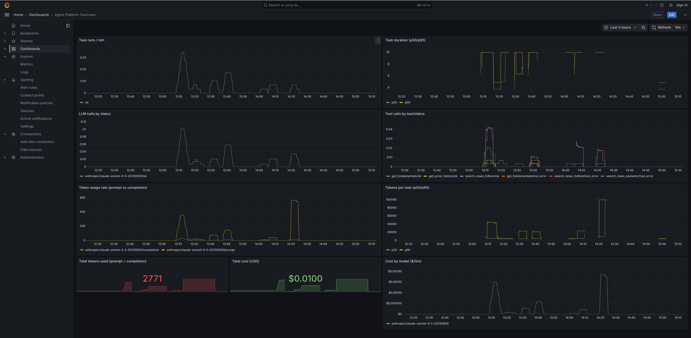
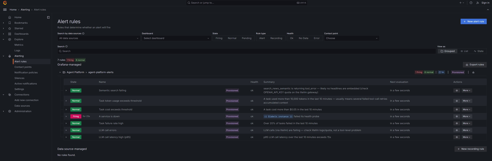
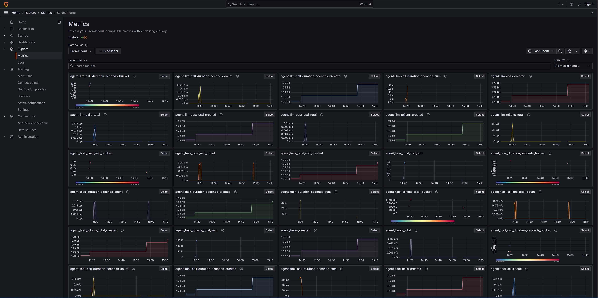
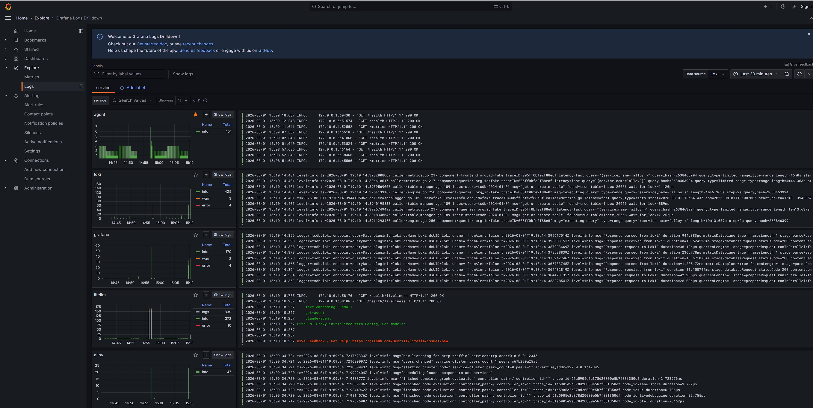

# Agent Platform

A local, docker-compose-based platform for running an LLM agent end-to-end against NYSE
fundamentals/prices and 1.24M ABC News headlines — with the observability (metrics, logs,
traces, alerting) a production deployment would actually need, not just a toy demo.

- **What it does**: a FastAPI agent runs a tool-calling loop (the [Strands Agents SDK](https://strandsagents.com),
  via a LiteLLM gateway to Claude/GPT) over four fixed, typed tools against Postgres+pgvector —
  no text-to-SQL, no free-form DB access.
- **Why it looks like this**: see [DECISIONS.md](DECISIONS.md) — what's included, what's
  deliberately left out, and how it evolves toward a real Kubernetes production deployment.
- **How to run it / operate it**: see [RUNBOOK.md](RUNBOOK.md) — starting the stack, running
  tasks, reading dashboards, querying logs, understanding alerts, troubleshooting.

## Quick start

```bash
cp .env.example .env   # fill in ANTHROPIC_API_KEY / OPENAI_API_KEY
docker compose up --build -d
./scripts/run_task.sh "What was AAPL's most recent reported net income?"
```

That's it — data ingestion, schema setup, and the read-only DB role are all handled
automatically by the `ingest` service as part of that one command. See
[RUNBOOK.md](RUNBOOK.md#starting-the-stack) for what's actually happening.

## A day in the life of this platform

Someone runs `./scripts/run_task.sh "..."` a few dozen times over an afternoon — some
plain fundamentals lookups, some multi-topic tasks that need several tool-call retries.
Here's what that afternoon actually looks like from the operator's side.

**It starts at the dashboard.** One glance answers the questions that matter first: is
throughput normal, is anything failing, is spend where it should be. The task-runs and
tool-calls panels show the shape of that afternoon's traffic; the bottom row answers "how
much did this cost" in one number — `$0.0100` and 2,771 tokens here — no PromQL required.



**Something's flagged before anyone has to go looking for it.** This is the same
Prometheus data the dashboard reads, evaluated continuously against 7 rules instead of
watched by a human. `"A service is down"` is firing — note the raw
`{{ $labels.instance }}` sitting unrendered in the summary column, which is genuinely how
Grafana shows a rule's *template* in the list view; open the firing instance itself and it
resolves to the actual service name. The other six rules — semantic-search failures,
per-task token/cost blowouts, task failure rate, LLM errors, LLM latency — are `Normal`
right now, which is itself useful information: nothing else needs attention.



**The dashboard's 9 panels are a curated view — everything Prometheus actually has is
bigger than that.** Every `agent_*` metric this platform emits — LLM call counts and
durations, per-model token/cost counters, the per-task histograms that make the alert
thresholds possible — shows up here automatically, browsable without writing a query, the
moment `docker compose up` starts scraping it.



That auto-discovery view mixes our metrics in with ~10 `python_*`/`process_*` runtime
metrics `prometheus_client` registers for free, and expands further per label/bucket
combination (50+ entries there, not 10) — there's also a dedicated **"Agent Custom
Metrics (raw)"** dashboard with exactly one panel per custom metric, nothing else, for
when you want the signal without the noise. Both dashboards live in Grafana's
**"Agent Platform"** folder, alongside the 7 alert rules.

**Metrics tell you something's off; logs tell you what.** Every one of the 11 services in
this stack ships its logs here with zero per-service configuration — Alloy discovers
containers via the Docker API, so a new service in `docker-compose.yaml` just starts
flowing the moment it exists. `agent`, `loki`, `grafana`, `litellm`, `alloy` are visible
here mid-scroll; the same view covers `postgres`, `jaeger`, `prometheus`, and the rest.



**And when one specific run needs a closer look, logs and traces aren't two separate
investigations.** This is the log line for one task's completion (`task completed ...
trace_id=d444eb09...`) split-paned against that exact trace in Jaeger, click-through in
both directions. The span on the right — `agent.llm_call`, 2.6s — shows precisely what
that call cost and did: the resolved model actually billed
(`anthropic/claude-sonnet-4-5-20250929`, not the `AGENT_MODEL` routing alias), completion
tokens, USD cost pulled straight from litellm's response headers, and the full outgoing
prompt text. This is the same trail every alert's `logs_link` walks you down automatically
— metric flags it, log names the task, trace shows exactly what happened.


Panel-by-panel reference, alert semantics, and LogQL query examples are all in
[RUNBOOK.md](RUNBOOK.md#dashboard-panels).

## Repository layout

```
agent/            FastAPI service — Strands Agents SDK tool-calling loop, /run, /health, /metrics
ingest/           One-shot data loader (CSV → Postgres, or fast restore from data/export/)
litellm/          Model gateway config (provider/model routing)
observability/    Prometheus, Grafana (dashboards/datasources/alerting), Loki, Alloy, blackbox_exporter configs
scripts/          run_task.sh — the CLI that exercises the full stack end-to-end
sql/              Postgres schema
data/raw/         Raw Kaggle CSVs, gzipped, tracked in git
data/export/      Pre-built Postgres COPY dumps, tracked in git — what makes a fresh clone's `docker compose up` need zero credentials beyond the two LLM provider keys (embeddings included, if present — pgvector's type round-trips through COPY transparently)
README.md         This file
DECISIONS.md      Design rationale, tradeoffs, production/Kubernetes architecture
RUNBOOK.md        Operational reference
```
