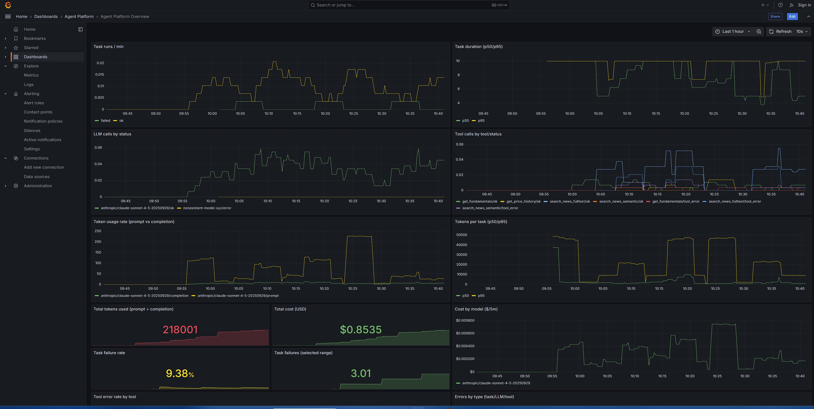
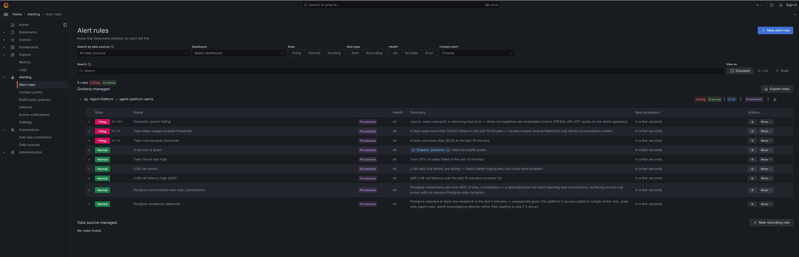
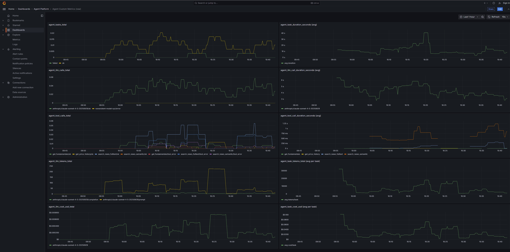
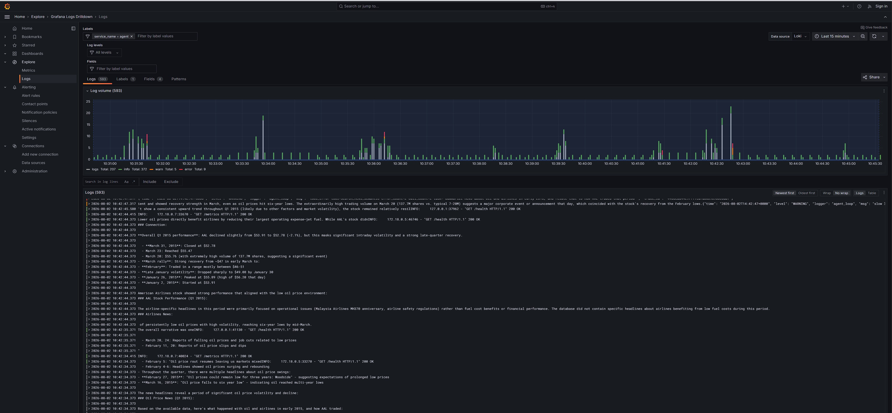
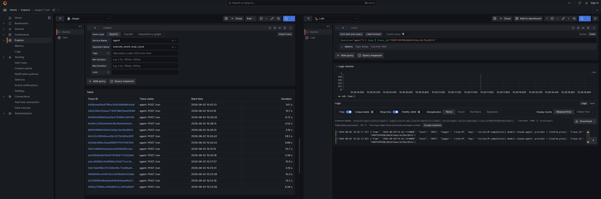
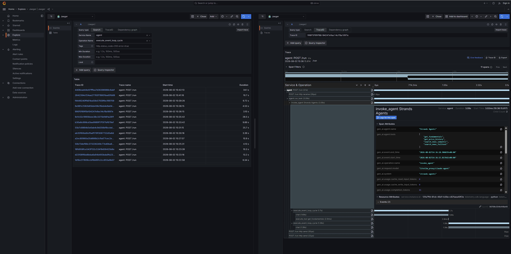

# Agent Platform

A local, docker-compose-based platform for running an LLM agent end-to-end against NYSE
fundamentals/prices and 1.24M ABC News headlines — with the observability (metrics, logs,
traces, alerting) a production deployment would actually need, not just a toy demo.

- **What it does**: a FastAPI agent runs a tool-calling loop (the [Strands Agents SDK](https://strandsagents.com),
  via a LiteLLM gateway to Claude/GPT) over four fixed, typed tools against Postgres+pgvector —
  no text-to-SQL, no free-form DB access.
- **Why it looks like this**: see [DECISIONS.md](DECISIONS.md) — what's included, what's
  deliberately left out, and how it evolves toward a real Kubernetes production deployment.
- **How to run it / operate it**: see [RUNBOOK.md](RUNBOOK.md) — starting the stack, running
  tasks, reading dashboards, querying logs, understanding alerts, troubleshooting.

## Quick start

```bash
cp .env.example .env   # fill in ANTHROPIC_API_KEY / OPENAI_API_KEY
docker compose up --build -d
./scripts/run_task.sh "What was AAPL's most recent reported net income?"
```

That's it — data ingestion, schema setup, and the read-only DB role are all handled
automatically by the `ingest` service as part of that one command. See
[RUNBOOK.md](RUNBOOK.md#starting-the-stack) for what's actually happening.

## A day in the life of this platform

Someone runs `./scripts/run_task.sh "..."` a few dozen times over an afternoon — some
plain fundamentals lookups, some multi-topic tasks that need several tool-call retries.
Here's what that afternoon actually looks like from the operator's side.

**It starts at the dashboard.** One glance answers the questions that matter first: is
throughput normal, is anything failing, is spend where it should be. The task-runs and
tool-calls panels show the shape of that afternoon's traffic; the bottom rows answer "how
much did this cost" and "is anything failing" in a handful of numbers — `$0.8535` and
218,001 tokens spent so far, a 9.38% task failure rate — no PromQL required.



**Something's flagged before anyone has to go looking for it.** This is the same
Prometheus data the dashboard reads, evaluated continuously against 9 rules instead of
watched by a human. Three are `Firing` here — `Semantic search failing`, `Task token usage
exceeds threshold`, and `Task cost exceeds threshold` — a direct, honest consequence of
deliberately mixed-in error/edge-case traffic (missing tickers, invalid models, oversized
compound tasks) rather than a staged screenshot. The other six — service-down, task
failure rate, LLM call errors, LLM call latency, and the two Postgres rules (connections
near max, deadlocks) — are `Normal`, which is itself useful information: nothing else
needs attention right now.



**The overview dashboard's 14 panels are a curated view — everything Prometheus actually
has is bigger than that.** Every `agent_*` metric this platform emits — LLM call counts
and durations, per-model token/cost counters, the per-task histograms that make the alert
thresholds possible, and now per-tool/per-type error rates too — shows up automatically
the moment `docker compose up` starts scraping it. The raw Prometheus auto-discovery view
mixes all of that in with ~10 `python_*`/`process_*` runtime metrics `prometheus_client`
registers for free, and expands further per label/bucket combination — which is exactly
why there's also a dedicated **"Agent Custom Metrics (raw)"** dashboard, shown below, with
exactly one panel per custom metric and nothing else, for when you want the signal without
the noise.



Both dashboards live in Grafana's
**"Agent Platform"** folder, alongside the 9 alert rules.

**Metrics tell you something's off; logs tell you what.** Every one of the 11 services in
this stack ships its logs here with zero per-service configuration — Alloy discovers
containers via the Docker API, so a new service in `docker-compose.yaml` just starts
flowing the moment it exists. This is Grafana's Logs Drilldown view filtered to
`service_name=agent` — 593 log lines and a volume histogram (color-coded by level) over
the last 15 minutes, JSON-structured entries readable straight off the raw line without a
query; the same view covers `postgres`, `litellm`, `jaeger`, and the rest with a one-label
change.



**And when one specific run needs a closer look, logs and traces aren't two separate
investigations.** This is Jaeger's trace search for `service=agent` (left) split-paned
against Loki filtered to that exact `trace_id` (right) — every LiteLLM completion call
this task made shows up correlated to the same ID, click-through in both directions. This
is the same trail every alert's `logs_link` walks you down automatically — metric flags
it, log names the task and its `trace_id`, Jaeger shows the full span tree for it
(`invoke_agent`, `execute_event_loop_cycle`, `chat`, `execute_tool` — Strands' own
automatic instrumentation) including per-call token usage. Per-call cost isn't in Strands'
spans (it has no pricing knowledge) — that's added back as a span event on the root span,
computed via `litellm.cost_per_token()` against the resolved model
(`anthropic/claude-sonnet-4-5-20250929`, not the `AGENT_MODEL` routing alias). Prompt/
response text is deliberately *not* captured in either the logs or the trace — a real,
live decision about how much request/response content to let a tracing backend retain,
not something to inherit by accident.



**That span tree, opened up.** `agent: POST /run` (3.1s total) contains `agent.run_task`,
which contains Strands' own `invoke_agent Strands Agents` span — its attributes list
`gen_ai.agent.tools` (all four tools this agent can call), the resolved
`gen_ai.request.model` (`litellm_proxy/claude-agent`), and per-call token counts, all
emitted automatically, no manual instrumentation. Nested underneath, one
`execute_event_loop_cycle` per LLM<->tool round trip, each containing its own `chat` span
and an `execute_tool get_fundamentals`/etc. span for every tool call the model made that
turn — the exact shape of `MAX_ITERATIONS`/`Limits(turns=...)` described in
[DECISIONS.md](DECISIONS.md), made visible.



Panel-by-panel reference, alert semantics, and LogQL query examples are all in
[RUNBOOK.md](RUNBOOK.md#dashboard-panels).

## Repository layout

```
agent/            FastAPI service — Strands Agents SDK tool-calling loop, /run, /health, /metrics
ingest/           One-shot data loader (CSV → Postgres, or fast restore from data/export/)
litellm/          Model gateway config (provider/model routing)
observability/    Prometheus, Grafana (dashboards/datasources/alerting), Loki, Alloy, blackbox_exporter configs
scripts/          run_task.sh — the CLI that exercises the full stack end-to-end
sql/              Postgres schema
data/raw/         Raw Kaggle CSVs, gzipped, tracked in git
data/export/      Pre-built Postgres COPY dumps, tracked in git — what makes a fresh clone's `docker compose up` need zero credentials beyond the two LLM provider keys (embeddings included, if present — pgvector's type round-trips through COPY transparently)
README.md         This file
DECISIONS.md      Design rationale, tradeoffs, production/Kubernetes architecture
RUNBOOK.md        Operational reference
```
